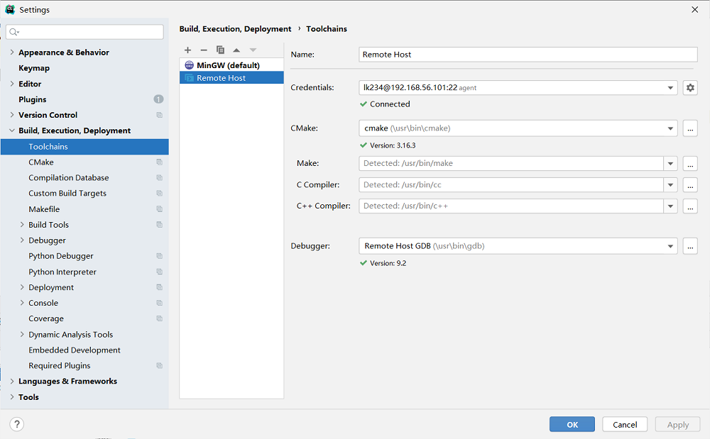
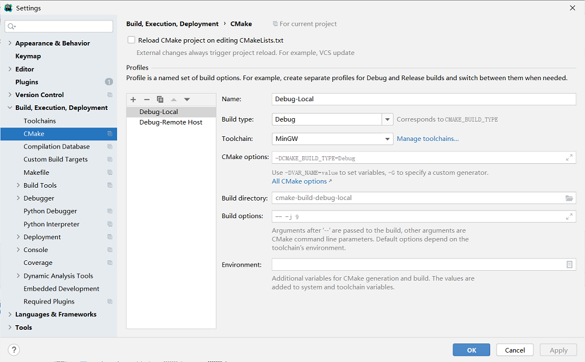
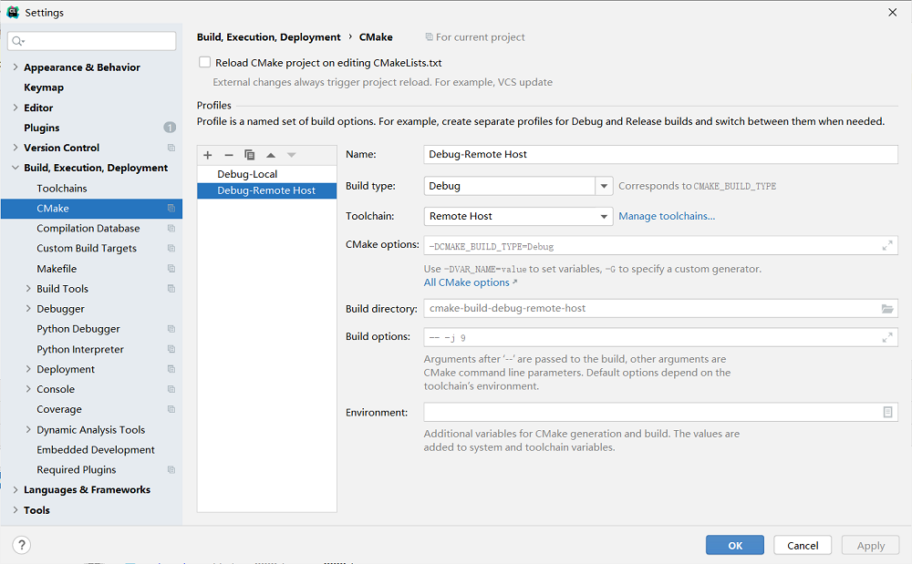
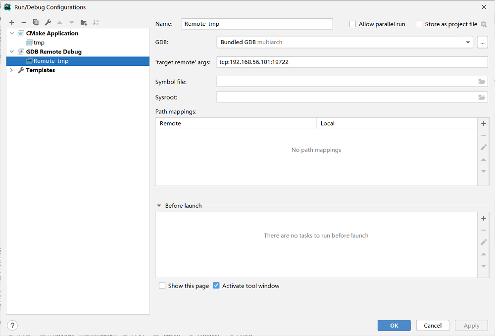

### 1. gdbserver&debug
```
// gdbserver :19722 /tmp/tmp.qvOA5jbhHH/cmake-build-debug/tmp（gdbserver HostIp:Port dir）
// 运行到最后一个大括号处点击 resume program 就不会进 disassembly 窗口
```
### 2. File->settings




